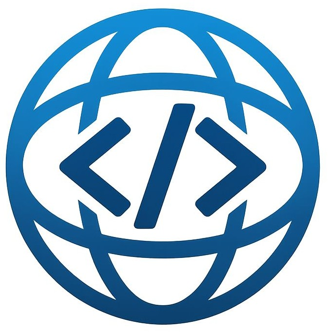
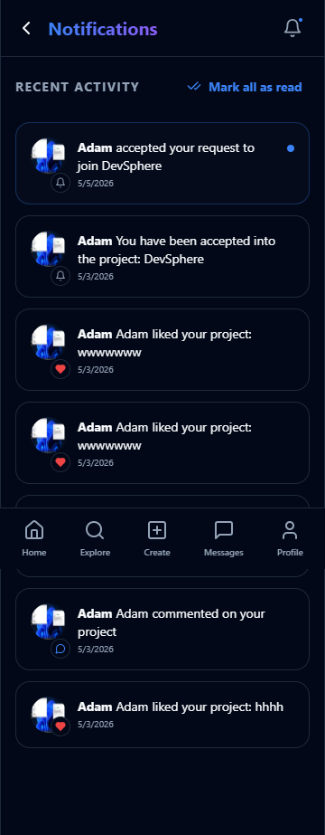
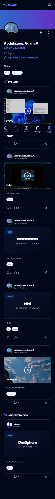
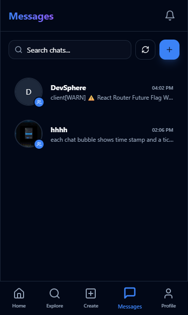
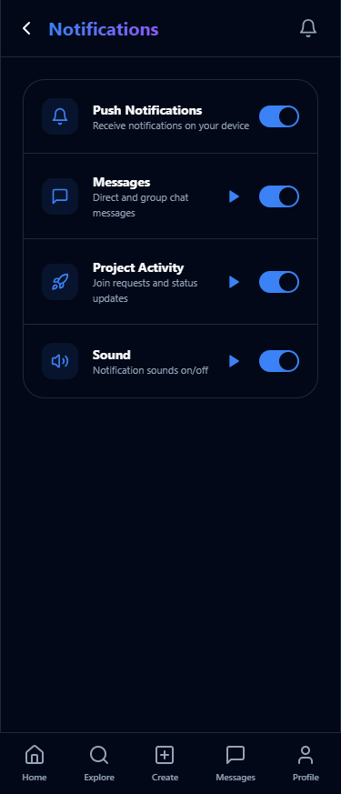

# 🚀 DevSphere — Build Together. Ship Together.

**An AI-Powered Developer Collaboration Platform built with Alibaba Cloud Qwen-Plus.**

> *"DevSphere doesn't simply showcase ideas, it helps teams build them together."*

> *"DevSphere communicates with Alibaba Cloud Qwen models through the DashScope Workspace OpenAI-compatible API."*



## 🛡️ Badges

### Global AI Hackathon_AI Application & Alibaba Cloud_Qwen

| Global AI Hackathon_AI Application | Alibaba Cloud_Qwen |
| :---: | :---: |
|  |  |

---

## 🌍 The Problem

Modern software development is highly fragmented. Developers constantly switch between multiple disconnected platforms—GitHub for code, Discord or Slack for chat, WhatsApp for quick updates, Notion or Trello for task tracking, and LinkedIn for recruiting teammates. This fragmentation leads to several critical challenges:

* **Collaborator Friction:** Finding reliable, skilled collaborators who share the same vision is incredibly difficult.
* **Abandoned Ideas:** Countless promising startup and open-source ideas are abandoned simply because teams never form or lose momentum.
* **Scattered Knowledge:** Project context, decisions, and planning are scattered across multiple tools, leading to misalignment.
* **Inefficient Onboarding:** New contributors face a steep learning curve trying to understand the project's architecture, goals, and current status.
* **Lack of Guidance:** Teams often lack structured project management, leading to scope creep, poor technical decisions, and project stagnation.

DevSphere solves these problems by bringing project discovery, team formation, real-time communication, task management, and context-aware AI assistance into a single, unified platform.

---

## 🌍 Global AI Hackathon — Track 2: AI Application

DevSphere is an intelligent developer collaboration platform that combines real-time team formation, project discovery, and contextual AI assistance to help software teams build better products together. Instead of working alone or abandoning great ideas, developers can find teammates, manage projects, communicate, and receive AI-powered project guidance—all within one platform.

---

## 🧠 Context-Aware AI Project Manager Engine

Every project interaction follows a complete project management lifecycle:

• Retrieve project details (Problem, Solution, Stage, Skills)
• Retrieve creator and team context
• Identify the user's project role (Visitor, Applicant, Member, Owner)
• Reason with Alibaba Cloud Qwen-Plus
• Return actionable recommendations tailored to the current project

This ensures responses remain highly relevant instead of behaving like a generic chatbot.

### AI Capabilities

The Context-Aware AI Project Manager provides deep, actionable assistance across the entire project lifecycle:

* **Context-Aware Project Reasoning:** Answers questions about the project's core vision, problem statement, and proposed solution.
* **Role-Aware Recommendations:** Tailors advice based on whether the user is a visitor, applicant, team member, or project owner.
* **Sprint Planning:** Helps organize development cycles, prioritize features, and set realistic milestones.
* **Roadmap Generation:** Creates structured 1-month, 3-month, or 6-month product roadmaps based on the project's current stage.
* **Task Breakdown:** Deconstructs high-level features into granular, actionable development tasks.
* **Architecture Guidance:** Recommends scalable folder structures, database schemas, and API designs.
* **Feature Prioritization:** Evaluates user-proposed ideas and provides objective technical reasoning on what to build first.
* **Technical Decision Support:** Explains the advantages and disadvantages of different technologies, libraries, and frameworks.
* **Onboarding Assistance:** Generates customized onboarding guides and setup instructions for new contributors.
* **Risk Analysis:** Identifies potential technical risks, security vulnerabilities, and scalability bottlenecks.

### 🧠 How the AI Thinks

Every interaction with the Context-Aware AI Project Manager triggers a structured reasoning pipeline that ensures highly relevant, grounded responses:

```text
┌─────────────────────────────────────────────────────────┐
│                    Project Metadata                     │
│  (Title, Problem, Solution, Description, Stage, Skills) │
└────────────────────────────┬────────────────────────────┘
                             │
                             ▼
┌─────────────────────────────────────────────────────────┐
│                    Team Information                     │
│         (Founder Identity, Active Team Members)         │
└────────────────────────────┬────────────────────────────┘
                             │
                             ▼
┌─────────────────────────────────────────────────────────┐
│                User Role & Permissions                  │
│       (Visitor, Applicant, Team Member, Owner)          │
└────────────────────────────┬────────────────────────────┘
                             │
                             ▼
┌─────────────────────────────────────────────────────────┐
│                  Conversation Context                   │
│                 (Recent Chat History)                   │
└────────────────────────────┬────────────────────────────┘
                             │
                             ▼
┌─────────────────────────────────────────────────────────┐
│                 Supabase Edge Function                  │
│          (Secure Server-Side Context Assembly)          │
└────────────────────────────┬────────────────────────────┘
                             │
                             ▼
┌─────────────────────────────────────────────────────────┐
│                Alibaba Cloud Qwen-Plus                  │
│             (Contextual Reasoning Engine)               │
└────────────────────────────┬────────────────────────────┘
                             │
                             ▼
┌─────────────────────────────────────────────────────────┐
│                 Context-Aware Response                  │
│       (Actionable, Role-Tailored Recommendations)       │
└─────────────────────────────────────────────────────────┘
```

The AI gathers this multi-dimensional context before generating recommendations, making responses deeply relevant to the current project instead of generic.

### Why Context Matters

Traditional AI assistants operate on isolated prompts, requiring users to repeatedly copy-paste project details, explain their tech stack, and describe their goals. This leads to generic, repetitive, and often irrelevant advice.

DevSphere's Context-Aware AI Project Manager reasons over an evolving software project. It continuously factors in the project's goals, development stage, team structure, and user permissions. This creates a continuous, personalized guidance loop that adapts as the project grows—providing the right advice to the right person at the right time.

---

## 📱 Application Interface

### 🏠 Home Dashboard & 🤖 Context-Aware AI Project Manager
| Home Dashboard | AI Project Manager |
| :---: | :---: |
|  |  |

### 🔍 Explore Projects & 👥 Team Management
| Explore Projects | Team Management |
| :---: | :---: |
|  |  |

## 🎥 Demo

Live Demo:
https://dev-sphere-kappa.vercel.app/

Demo Video:
https://www.youtube.com/watch?v=dQw4w9WgXcQ

---

## ✨ Core Features

- 🤝 **Project Discovery:** Browse community projects, discover startup ideas, and search by skills, technologies, and stages.
- 👥 **Team Formation:** Request to join projects, accept or reject applicants, and manage project members and roles.
- 🤖 **Context-Aware AI Project Manager (Powered by Qwen):** Every project includes an intelligent AI PM that understands the project context before responding.
- 💬 **Real-Time Collaboration:** One-to-one messaging, project group chats, read receipts, and system events for team activity.
- 🔔 **Smart Notifications:** Receive alerts for join requests, approvals, team activity, messages, and project updates.
- 👤 **Developer Profiles:** Create a professional developer profile featuring skills, bio, portfolio, experience, and title.
- 🎁 **Referral System:** Invite developers to join DevSphere and earn referral points toward future platform rewards.

---

## 🌎 Primary Users

DevSphere is designed to support a diverse ecosystem of builders:

* **Student Developers:** Find peers to build course projects, portfolio pieces, or study groups.
* **Startup Founders:** Recruit early co-founders, validate MVPs, and organize initial product roadmaps.
* **Indie Hackers:** Launch side projects, find specialized collaborators, and get structured development guidance.
* **Open Source Contributors:** Discover active repositories, understand project architectures, and onboard smoothly.
* **Remote Engineering Teams:** Collaborate in real-time with integrated chat, notifications, and project tracking.
* **Hackathon Participants:** Form teams instantly, brainstorm features, and plan rapid development sprints.
* **Technical Communities:** Foster collaboration, share knowledge, and showcase community-driven projects.

---

## 🗺️ Developer Journey

The typical lifecycle of a developer on DevSphere follows a structured, collaborative path:

```text
┌─────────────────────┐
│  Developer Sign Up  │
└──────────┬──────────┘
           │
           ▼
┌─────────────────────┐
│   Create Profile    │
│ (Skills, Bio, Title)│
└──────────┬──────────┘
           │
           ▼
┌─────────────────────┐
│  Discover Projects  │
│ (Explore & Filter)  │
└──────────┬──────────┘
           │
           ▼
┌─────────────────────┐
│      Join Team      │
│ (Apply to Founder)  │
└──────────┬──────────┘
           │
           ▼
┌─────────────────────┐
│     Collaborate     │
│ (Group & DM Chats)  │
└──────────┬──────────┘
           │
           ▼
┌─────────────────────────────────────────┐
│    Context-Aware AI Project Manager     │
│ (Roadmaps, Task Breakdowns, Debugging)  │
└──────────┬──────────────────────────────┘
           │
           ▼
┌─────────────────────┐
│   Sprint Planning   │
│ (Milestones & Tasks)│
└──────────┬──────────┘
           │
           ▼
┌─────────────────────┐
│    Build Product    │
│ (Code & Collaborate)│
└──────────┬──────────┘
           │
           ▼
┌─────────────────────┐
│    Launch Project   │
│ (Publish to Sphere) │
└─────────────────────┘
```

---

## 🏗️ Technical Architecture

DevSphere's end-to-end AI and collaboration architecture is illustrated below:

```text
┌──────────────────────────────────────────┐
│             React Frontend               │
│   Home • Explore • Create • Chat • Team  │
└──────────────────┬───────────────────────┘
                   │
                   ▼
        ┌────────────────────────┐
        │  Supabase Auth (JWT)   │
        └───────────┬────────────┘
                    │
                    ▼
        ┌────────────────────────┐
        │ PostgreSQL Database    │
        │ • Profiles             │
        │ • Projects             │
        │ • Join Requests        │
        │ • Messages             │
        │ • Notifications        │
        │ • Referral Points      │
        └───────────┬────────────┘
                    │
                    ▼
      ┌────────────────────────────────┐
      │ Supabase Edge Functions        │
      │ • project-manager              │
      └───────────────┬────────────────┘
                      │
                      ▼
      ┌────────────────────────────────┐
      │ Alibaba Cloud DashScope API    │
      └───────────────┬────────────────┘
                      │
                      ▼
      ┌────────────────────────────────┐
      │ Qwen-Plus AI Reasoning         │
      │ • Project Awareness            │
      │ • Role-Based Intelligence      │
      │ • Contextual Reasoning         │
      │ • Secure Design                │
      └───────────────┬────────────────┘
                      │
                      ▼
┌──────────────────────────────────────────┐
│      Live Dashboard & AI Project PM      │
│  Roadmaps • Task Lists • Chat • UI       │
└──────────────────────────────────────────┘
```

1. **Project Setup:** Users create or join projects, establishing their roles and permissions.
2. **Contextual Reasoning:** Supabase Edge Functions (Qwen-Plus) analyze the project metadata, factoring in the user's role and permissions.
3. **State Synthesis:** The AI updates the project's roadmap, task lists, and sprint plans, providing fresh insights and recommended actions on the dashboard.

---

## 🛠️ Engineering Challenges Solved

Building a context-aware, real-time collaboration platform presented several complex engineering challenges:

* **State Synchronization across AI Conversations:** Ensuring the AI always has access to the latest project metadata, team memberships, and user roles without overloading the context window. This was solved by designing a server-side context assembly layer in Supabase Edge Functions that queries the database in real-time before invoking the AI.
* **Role-Aware AI Reasoning:** Designing a system prompt that dynamically adapts the AI's persona, permissions, and output style based on the user's relationship to the project (e.g., preventing visitors from seeing private planning details while giving owners advanced sprint planning tools).
* **Grounding AI Responses to Prevent Hallucination:** Restricting the AI from fabricating project details, team members, or deadlines. We implemented strict grounding rules in the system prompt, instructing the AI to explicitly state when information is unavailable rather than inventing it.
* **Real-Time Event Synchronization:** Keeping chat messages, read receipts, join requests, and notifications synchronized across multiple clients instantly. This was achieved by leveraging Supabase Realtime PostgreSQL replication and custom database triggers.
* **Secure AI Integration:** Protecting sensitive project information, database credentials, and the Alibaba Cloud API key. All AI reasoning is performed server-side within protected Supabase Edge Functions, ensuring the client never has direct access to the API keys or raw database secrets.

---

## 📂 Project Structure

```text
devsphere/
├── assets/
│   ├── images/             # App screenshots and brand logos
│   └── sounds/             # Custom notification chimes
├── supabase/
│   └── functions/          # Qwen-powered Edge Functions
│       └── project-manager/# AI Project Manager chat reasoning
└── src/
    ├── components/         # Reusable UI components (ProjectCard, AIManager, etc.)
    ├── context/            # Global state management (AppContext)
    ├── hooks/              # Custom React hooks (useIsMobile, useToast)
    ├── integrations/       # Supabase client & SQL logic
    ├── pages/              # App pages (Index, Explore, CreateProject, ChatScreen, etc.)
    ├── utils/              # Helper utilities (NotificationService, toasts)
    ├── App.tsx             # Main router and layout controller
    └── main.tsx            # Application entry point
```

---

## 🧠 Context-Aware AI Project Manager Implementation

DevSphere satisfies the AI Application requirements through four core capabilities:

### Project Awareness
The AI understands the project title, description, problem statement, proposed solution, development stage, required skills, team members, and founder information.

### Role-Based Intelligence
Responses adapt depending on who is interacting:
- **Visitors:** Learn what the project is about, understand required skills, and decide whether to join.
- **Applicants:** Receive onboarding guidance, learn project expectations, and identify preparation steps.
- **Team Members:** Receive implementation advice, task breakdowns, architecture recommendations, and debugging assistance.
- **Project Owners:** Sprint planning, roadmaps, milestones, hiring recommendations, scaling strategies, MVP planning, and release planning.

### Contextual Reasoning
The AI remains focused on the current project instead of acting as a general-purpose assistant. It avoids inventing missing project details and recommends scalable engineering practices whenever possible.

### Secure Design
Sensitive information such as authentication tokens, API keys, and private backend details are never exposed through AI responses.

---

## 🛠️ Tech Stack

- **Frontend:** React + TypeScript + Tailwind CSS
- **Database/Auth:** Supabase (PostgreSQL + RLS)
- **AI Engine:** Alibaba Cloud Qwen-Plus (DashScope Workspace Endpoint)
- **Deployment:** Vercel
- **Backend:** Supabase Edge Functions

---

## ☁️ Alibaba Cloud Integration

DevSphere leverages Alibaba Cloud's state-of-the-art **Qwen-Plus** model to power its Context-Aware AI Project Manager. 

### Why Alibaba Cloud Qwen-Plus?
* **Advanced Reasoning Capabilities:** Qwen-Plus excels at complex reasoning, structured planning, and technical decision-making, making it the perfect engine for a virtual project manager.
* **High-Performance Context Handling:** The model efficiently processes multi-dimensional context (project metadata, team structures, user roles, and chat history) to generate precise, grounded recommendations.
* **Developer-Friendly Integration:** DashScope's OpenAI-compatible API allowed us to seamlessly integrate Qwen-Plus into our existing backend architecture with minimal friction.

### Secure Server-Side Architecture
To ensure maximum security and performance, all communication with Alibaba Cloud is handled server-side:
1. The client sends a message and project ID to the Supabase Edge Function.
2. The Edge Function verifies the user's session and queries the PostgreSQL database to assemble the project context.
3. The Edge Function securely communicates with the DashScope API using the server-side `QWEN_API_KEY`.
4. The client receives the AI's response without ever exposing API keys, database secrets, or raw system prompts.

---

## 🏆 Hackathon Enhancements

During the Global AI Hackathon, DevSphere underwent significant engineering upgrades to transition from a basic project showcase into a fully-fledged, AI-powered collaboration ecosystem:

* **Context-Aware AI Project Manager:** Designed and implemented the entire AI Project Manager interface (`AIManager.tsx`) and backend reasoning engine.
* **Alibaba Cloud Qwen Integration:** Built the Supabase Edge Function (`project-manager`) to securely connect with Alibaba Cloud's Qwen-Plus model via the DashScope API.
* **Role-Aware Reasoning Engine:** Developed the multi-role prompt engineering architecture that adapts AI responses based on user permissions (Visitor, Applicant, Member, Owner).
* **Real-Time Team Workflows:** Built the join request system, team management dashboard, and real-time group chat synchronization.
* **Notification Architecture:** Implemented database triggers and real-time subscriptions to notify users of project updates, join requests, and messages instantly.
* **Referral System Foundation:** Created the referral code generation, tracking, and points system to incentivize community growth.

---

## 🚀 Getting Started

1. Set up your Supabase project.
2. Configure the `QWEN_API_KEY` in your Supabase Edge Function secrets.
3. Use the integrated SQL tools to set up the `profiles`, `projects`, `join_requests`, `messages`, and `notifications` schema.

```text
Clone Repository
      │
      ▼
Install Dependencies
      │
      ▼
Configure Supabase
      │
      ▼
Set QWEN_API_KEY
      │
      ▼
Deploy Edge Functions
      │
      ▼
npm install
      │
      ▼
npm run dev

```

---

## 🔒 Security

DevSphere is designed with security in mind:
- Row-Level Security (RLS)
- Secure authentication
- Backend authorization
- Role-based project permissions
- Protected Edge Functions
- Secure AI integration using server-side API keys

---

## 🗺️ Future Roadmap

### Completed (Implemented)
* [x] User Authentication & Developer Profiles
* [x] Project Discovery & Advanced Filtering
* [x] Real-Time Direct & Group Messaging
* [x] Team Application & Member Management
* [x] Context-Aware AI Project Manager (Qwen-Plus)
* [x] Real-Time Notification System with Custom Sounds
* [x] Referral & Points System

### Coming Soon (Future Direction)
* [ ] **GitHub Integration:** Automatically sync repository issues, pull requests, and commits with the AI Project Manager.
* [ ] **AI Code Review:** Let the AI Project Manager review pull requests and suggest optimizations directly in the chat.
* [ ] **AI Sprint Automation:** Automatically generate and assign tasks to team members based on sprint goals.
* [ ] **Investor Matching:** Connect high-performing, active teams with potential investors and accelerators.
* [ ] **Cross-Project Knowledge:** Allow the AI to recommend collaborations between different projects building complementary technologies.
* [ ] **Smart Issue Tracking:** An integrated Kanban board where tasks are automatically updated by the AI Project Manager.

---

## ❤️ Why DevSphere?

Most collaboration platforms record tasks.

DevSphere builds teams.

By combining intelligent AI assistance, real-time collaboration, project discovery, and startup-focused team formation, DevSphere lowers the barrier between having an idea and launching a successful product.

## 🚀 What Makes DevSphere Different?

Unlike traditional project management tools that require manual updates, DevSphere continuously builds a contextual understanding of the project.

It learns from team activity, adapts its guidance based on the user's role, and provides objective technical reasoning using Alibaba Cloud Qwen as its reasoning engine.

The result is an AI Project Manager that becomes more personalized with every interaction.

---

## 📄 License

MIT License

Built with Alibaba Cloud Qwen

Built for Global AI Hackathon 2026